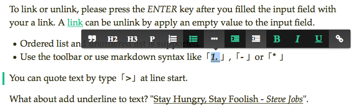

# WriteOn
Welcome to WriteOn. We're on a mission to create the world's finest writing experience. WriteOn is for story makers and writers who are looking for a clean, consistent and secure writing experience that helps you write and publish your stories, articles, documents and files across the web.

# Pad (editor)

- **Markdown is supported**
- **Inline formatting menu like those found at Medium**

******************



******************


## 1. Installation

#### 1.1 init with id attribute

```js
var editor = new Pad('#editor');
```

#### 1.2 init with an element

```js
var editor = new Pad(document.getElementById('editor'));
```

#### 1.3 init with options

```js
var options = {
  editor: document.body, // {DOM Element} [required]
  class: 'pad', // {String} class of the editor,
  debug: false, // {Boolean} false by default
  textarea: '<textarea name="content"></textarea>', // fallback for old browsers
  list: ['bold', 'italic', 'underline'] // editor menu list
}

var editor = new Pad(options);
```

## 2. configure

The following object sets up the default settings of Pad:

```js
defaults = {
  class: 'pad',
  debug: false,
  textarea: '<textarea name="content"></textarea>',
  list: [
    'blockquote', 'h2', 'h3', 'p', 'insertorderedlist', 'insertunorderedlist',
    'indent', 'outdent', 'bold', 'italic', 'underline', 'createlink'
  ],
  stay: true
}
```

If you want to customize the toolbar to fit your own project, you can instanciate `Pad` constructor with an `options` object like [#1.3: init with options](https://github.com/BeardandFedora/WritOn-Pad#13-init-with-options):

#### 2.1 Fallback for old browser

You can set `defaults.textarea` to a piece of HTML string, by default, it's `<textarea name="content"></textarea>`。This will be set as `innerHTML` of your `#editor`.

#### 2.2 Change the editor class

Pad will add `.pad` to your editor by default, if you want to change the class, make sure to replace the class name `pad` to your own in `src/pad.css`.

#### 2.3 Enable debug mode

If `options.debug` is set to `true`, Pad will output logs to the Console of your browser.

#### 2.4 Customize the toolbar

You can set `options.list` to an `Array`, add the following strings to make your own:

- `blockquote`, `h2`, `h3`, `p`, `pre`: create a tag as its literal meaning
- `insertorderedlist`: create an `ol>li` list
- `insertunorderedlist`: create a `ul>li` list
- `indent`: indent list / blockquote block
- `outdent`: outdent list / blockquote block
- `bold`: wrap the text selection in a `b` tag
- `italic`: wrap the text selection in an `i` tag
- `underline`: wrap the text selection in a `u` tag
- `createlink`: insert link to the text selection
- `inserthorizontalrule`: insert a `hr` tag

#### 2.5 Prevent unsafe page redirect

By default, Pad will prevent unsafe page redirect when editing, to shut down it, specific `options.stay` to `false`.

__NOTE:__ if `defaults.debug` is set to `true` and `default.stay` is not set: `defaults.stay == !defaults.debug`.

#### 2.6 Disable and Re-enable editor

You can disable the pad editor by call `destroy()` method of the `var pad = new Pad(options)` object. like:

```js
var pad = new Pad('#editor');

pad.destroy(); // return itself
```

And, there's a corresponding method called `rebuild()` to re-enable the editor:

```js
pad.rebuild(); // return itself
```

## 3. markdown syntax support

#### 3.1 install
The syntax convertor will be enabled automatically by linking `markdown.js` after `pad.js: 

```html
<script src="src/pad.js"></script>
<script src="src/markdown.js"></script>
```

#### 3.2 usage
To use it, you can type `action cmd` + `space key` at a line start. like: 

```
### This will create a h3 tag
```

The following cmds are allowed: 

- Headings: type 1~6 `#` at the line start
- Unordered List: type `- ` or `* `
- Ordered List: type `1. `
- Code block: type **\`\`\`**
- Block Quote: type `> `
- Horizontal Rule: more than 3 `-`, `*`, `.` will create a `<hr />`, like `......`

## 4. license

Licensed under MIT.